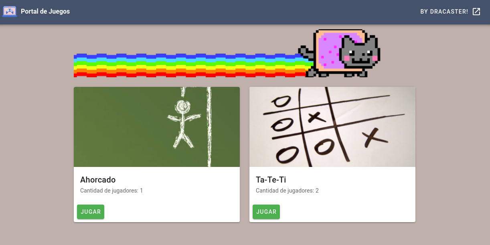

<h1 align="center">
  <br>
  
  <br>
  Game Portal
  <br>
</h1>

<h4 align="center">Un portal de juegos clásicos.</h4>

<p align="center">
  <a href="#novedades">Novedades</a> •
  <a href="#muy-pronto">Muy pronto</a> •
  <a href="#desarrollo">Desarrollo</a> •
  <a href="#instalacion">Instalación</a> •
  <a href="#versiones">Versiones</a> •
  <a href="#creditos-y-licencia">Creditos y Licencia</a>
</p>



## Novedades

* Primera versión 1.0 !
 
* Juegos incluidos en esta version:
    - Ahorcado 
    - Ta Te Ti
  

## Muy pronto

* Juegos en desarrollo:
  - Piedra-Papel-Tijera-Lagarto-Spock
  - Batalla Naval
  
* En los juegos de un solo jugador, posibilidad de guardar la partida para más tarde.


## Desarrollo

Desarrollado con:

- VueJS
- Vuetify
- NodeJS
- Express
- Socket IO

## Instalacion

Para el cliente:

_Acceder a la carpeta game-portal-client:_

```
cd game-portal-client
```
_Instalar las dependencias:_

```
npm install
```

_Variables de entorno:_

Renormbrar el archivo .env.example el cual se encuentra alojado en la base, y configurar los valores de cada variable.

_Correr el proyecto:_

```
npm run serve
```

Para el servidor:

_Acceder a la carpeta game-portal-server:_
```
cd game-portal-server
```
_Instalar las dependencias:_

```
npm install
```

_Variables de entorno:_

Renombrar el archivo .env.example y configurar los valores de las variables de entorno.

_Correr el proyecto:_

```
npm start
```

## Versiones

1.0 - Se incorpora juegos del ahorcado y ta te ti


## Creditos y Licencia

Desarrollado por: Lujan Rojas - Email: lujanrojas.informatica@gmail.com


---

> [Linkedin](https://linkedin.com/in/lujanrojasinformatica/) &nbsp;&middot;&nbsp;
> GitHub [@DraCaster](https://github.com/DraCaster) &nbsp;&middot;&nbsp;
> Twitter [@LushanLuu](https://twitter.com/LushanLuu)

